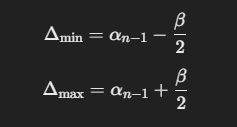

# Anomali Detection
## Pendeteksi kesalahan pergerakan driver berdasarkan perhitungan Bearing Angle.

Program ini menggunakan konsep sudut `bearing`, untuk menentukan posisi driver benar atau salah dengan batasan sudut deviasi tertentu, jika besar sudut bearing yang dibentuk pada posisi satu ke posisi lain dalam pergerakan driver melebihi atau kurang dari batas sudut deviasi maka akan dianggap sebagai anomali, use case ini diterapkan sebenarnya untuk mengetahui apakah driver bergerak mundur dari rute yang seharunya maju terus mengikuti jalan.

# Alur Kerja

1. Hitung sudut bearing antar dua titik (koordinat latitude dan longitude masing2) sesuai urutan pergerakan.
misal pergerakan : `A-B-C-D`, maka hitung bearing point: `A-B`, `B-C`, `C-D` dst.

2. Berikan besar sudut deviasi, misal 120°. Artinya dari sudut pandang driver arah hadap merupakan titik 0°, sehingga batas deviasi adalah 60° ke-kiri dan 60° ke-kanan sisi driver.

3. Hitung range sudut deviasi tersebut terhadap arah Utara (sebagai arah 0° sebagai pengamat), misal: posisi driver terhadap utara 60°, dengan besar deviasi ditentukan 120°, maka untuk menghitung letak sudut deviasi tersebut terhadap arah utara dengan :

keterangan:

Δmin = letak derajat sudut deviasi awal (minimum)
Δmax = letak derajat sudut deviasi akhir (maximum)
α = sudut bearing
β = sudut deviasi 

4. Bandingkan besar sudut bearing antar titik yang terbentuk terhadap rentang deviasi terhadap utara [minimum, maximum]. jika kurang atau melebihi range tersebut maka dianggap anomali. 